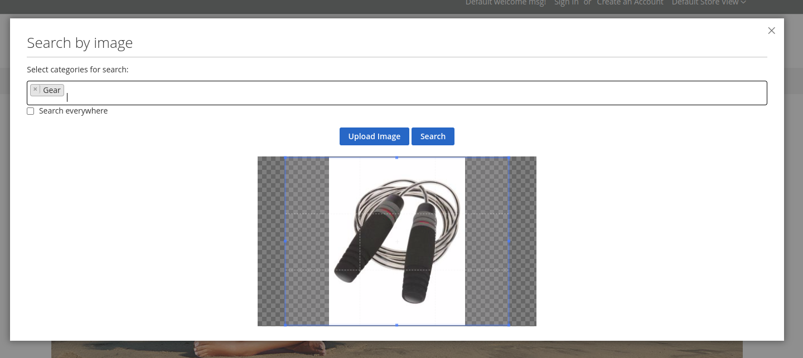
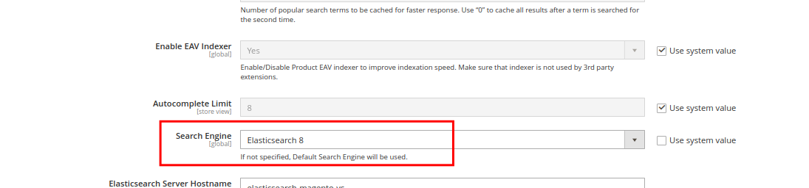
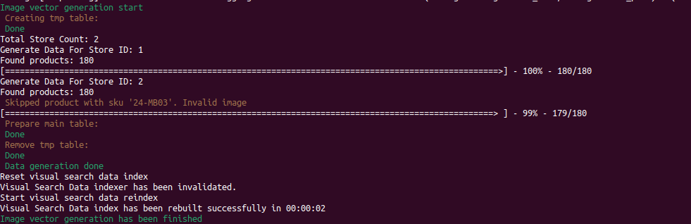
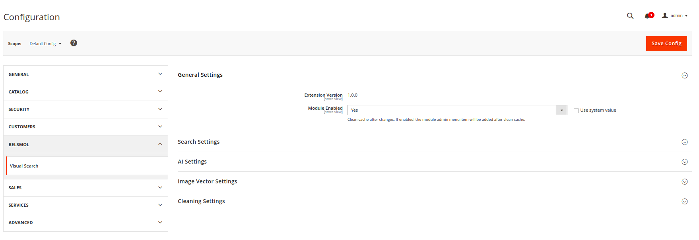
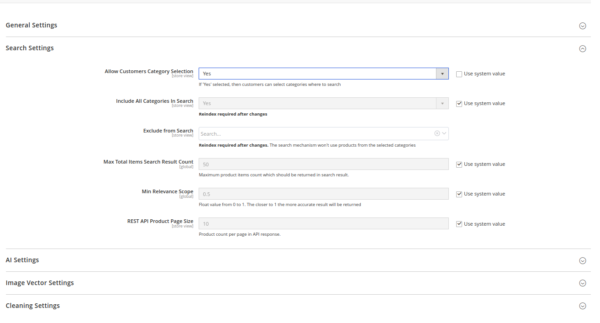
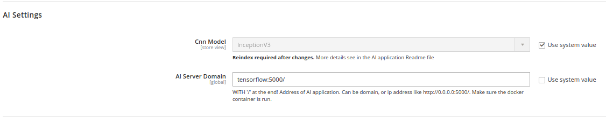
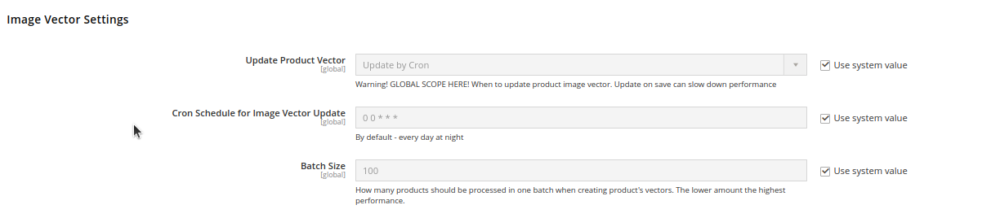
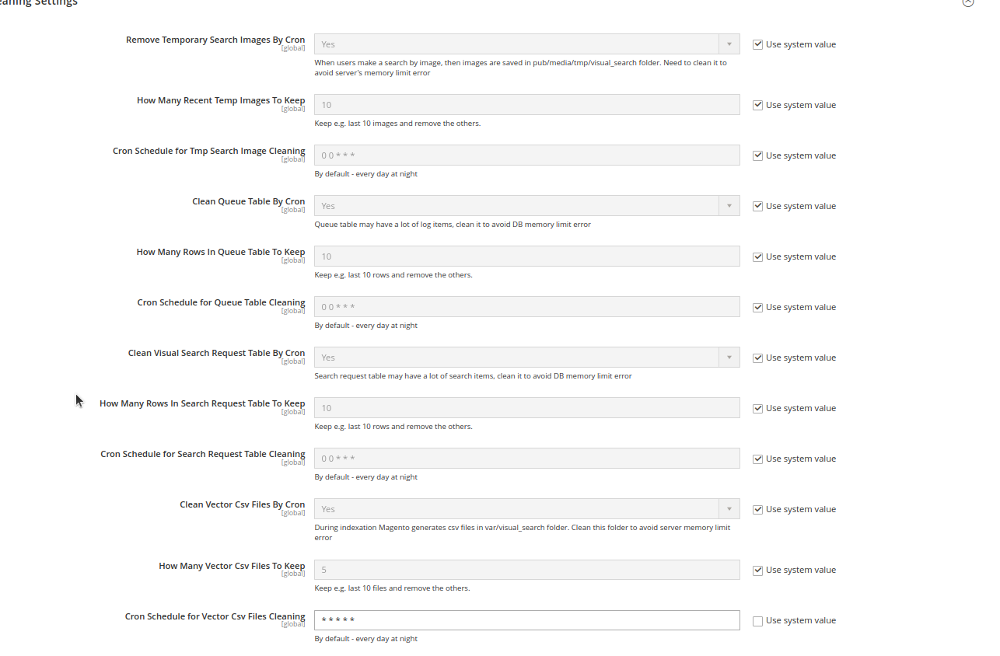
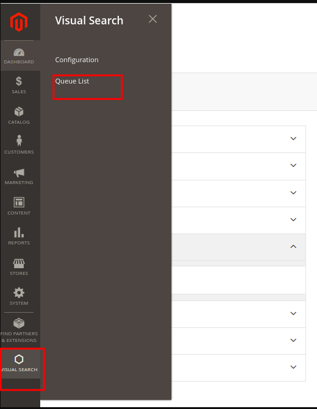
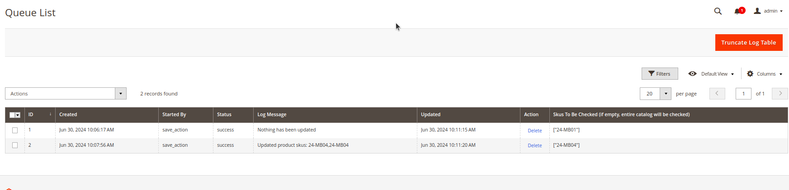

# Magento 2 Visual Search Module

You use this module on your risk!

This module mostly is a proof of concept. Please, adjust it to your needs.

## Overview

The Magento 2 Visual Search module is a tool designed to enhance the shopping experience by enabling image-based search 
functionality. This module leverages cutting-edge image recognition technology and Convolutional Neural Networks (CNN) 
to allow users to search for products using images instead of text.

#### Key Features:

1) <strong>Image-Based Search</strong>: Users can upload an image to find visually similar products in the store. 
The module analyzes the uploaded image to identify key features and patterns.

2) <strong>Advanced CNN Model</strong>: Utilizes a sophisticated Convolutional Neural Network model to process and interpret images.
Ensures high accuracy and relevance in search results by understanding complex visual data.

3) <strong>Seamless Integration</strong>: Works out of the box with Magento 2, requiring minimal configuration.
Easily integrates into existing Magento 2 themes and layouts.

4) <strong>User-Friendly Interface</strong>: Simple and intuitive search interface for customers.

5) <strong>Scalability</strong>: Scalable architecture to support growing product inventories and user base.





## System requirements:

1) Elasticsearch >= 8.4.3 (https://www.elastic.co/guide/en/elasticsearch/reference/current/knn-search.html)

2) Installed magento/module-elasticsearch-8 and set Elasticsearch 8 engine in:
Stores -> Configuration -> Catalog -> Catalog Search -> Search Engine (must be Elasticsearch 8)

```
composer require magento/module-elasticsearch-8 --with-all-dependencies
```



3) Magento >= 2.4.6 and PHP >= 8.1 - for Open Source only

4) RabbitMq run and make sure consumers are run

5) Cron enabled

6) Create the following folder in your 'var' directory "visual_search folder"

7) memory_limit = 8G

8) AMD/Intel CPU/APU 64bit(SSE2 or later)

9) Linux server

10) Make sure user has rights to run "Exec()" php function

11) Make sure in your elasticsearch.yaml you have the following:


```
cluster.name: "docker-cluster"
network.host: 0.0.0.0
indices.id_field_data.enabled: true # to fix this: https://docs.hevodata.com/sources/dbfs/databases/elasticsearch/config-changes-in-elasticsearch/#exception-while-sorting-or-aggregating-by-the-_id-field
```

If you use docker, you can make the mounting something like that:


```
    elasticsearch-magento-vs:
        build: ./docker/elasticsearch
        volumes:
            - ./docker/elasticsearch/elasticsearch.yml:/usr/share/elasticsearch/config/elasticsearch.yml
        environment:
          - discovery.type=single-node
          - "ES_JAVA_OPTS=-Xms512m -Xmx512m"
          - xpack.security.enabled=false   # Add this line to disable security
```


12) Catalog images must be saved in pub/media/catalog/product


## Installation:

Please, make sure that you did all from the System Requirements

Before you start, please deploy locally tensorflow application. Please, read the Readme file inside this folder of current module: "_tensorflow_app"

Or use a quick link: [_tensorflow_app Documentation](_tensorflow_app/README.md).

Please, be sure you have run RabbitMq and all consumers are run. 

Please, make sure that crons enabled.

Please, create the following folder in your "var" directory - "visual_search folder"

After all done, generate initial vectors for your catalog:

```
            bin/magento visual-search:vector-data:build
```

This is performed command, run in background.

The command output example:



After that, you are able to use visual search on FE side.


## Admin Config Settings

Go to admin panel

```
Stores -> Settings -> Configuration -> Tab "BelSmol" -> "Visual Search"
```








## Admin Queue Overview

In case, If you update product vectors on "Save", the Queue tasks will be created. You can find the tasks statuses here:





## Cli Command Overview
The Module supports the following list of cli commands:

1) Update product image vectors by skus:

```
   bin/magento visual-search:vector-data:update --skus XXX,YYY,ZZZ
```

Notice: run in background mode


2) Generate product vectors from scratch:

```
   php bin/magento visual-search:vector-data:build
```

Notice: run in background mode

## Useful links:

* https://www.tensorflow.org/install/docker
* https://www.tensorflow.org/install/pip#linux
* https://www.elastic.co/guide/en/elasticsearch/reference/current/knn-search.html
* https://blog.griddynamics.com/create-image-similarity-function-with-tensorflow-for-retail/
* https://www.elastic.co/blog/introducing-approximate-nearest-neighbor-search-in-elasticsearch-8-0
* https://www.analyticsvidhya.com/blog/2021/01/querying-similar-images-with-tensorflow/
* https://blog.tensorflow.org/2021/09/introducing-tensorflow-similarity.html
* https://keras.io/examples/vision/metric_learning_tf_similarity/
* https://www.tensorflow.org/tutorials/keras/classification
* https://dzlab.github.io/dltips/en/tensorflow/tensorflow-projector/
* https://www.oreilly.com/library/view/practical-deep-learning/9781492034858/ch04.html
* https://www.capellasolutions.com/blog/how-to-implement-vector-search-in-elasticsearch-a-practical-guide
